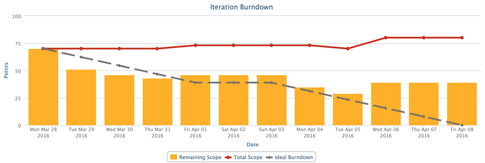

# Iteration Burndown by Points
A CA Agile Central App to show a Team's burndown by points for an iteration. The graph includes an ideal line, actual burndown, and scope change.

## Background
This app was created during the 2016.Q1 CA Hackathon. Its goal is to give Team's an actionable burndown based on points as many Teams do not task their work in hours.

## Features
This app can be configured to meet a Team's workflow by through the global variables:
 * UNCOMMITTED_SCHEDULE_STATES - states, like Idea, not count in an iteration commitment
 * COMPLETED_SCHEDULE_STATES - states that should be counted as done, such as just Released
 
The ideal line uses the iteration's initial scope and calculates a velocity needed to get to zero by the end of the iteration. The line goes flat on Saturday and Sunday to show the Team is now expected to work on weekends.

The current day's value is calculated at run-time, which prior days are the status at the end of the day.

## Extensibility
You can use this app as a base for your own app that uses the Lookback API to chart historic values in an iteration. Colors can be tweaked via CSS and line calculation via the config options described above.